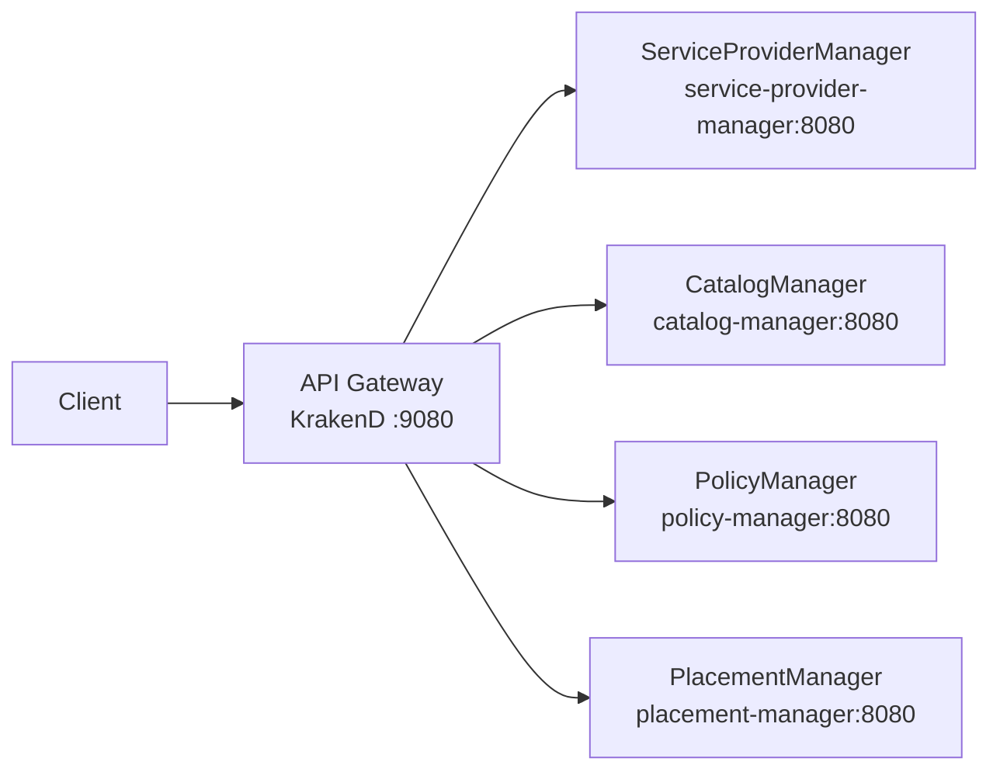

# DCM API Gateway

Central clearing house for the DCM control plane: single entry point (ingress) and single exit point (egress) for all communication.

## Overview

- **Ingress:** Clients and frontends send REST requests to the gateway; the gateway routes them to internal managers (ServiceProviderManager, PlacementManager, PolicyManager, CatalogManager).
- **Egress:** Outbound calls from DCM to external systems are intended to go through the gateway (see [Egress](#egress) below). Placeholders only in this deliverable.
- **Stateless:** No server-side sessions; each request is independent.
- **Auth:** Not in scope for the first deliverable; Keycloak (or another IdP) will be added later.



## Running the gateway

### Prerequisites

- [KrakenD](https://www.krakend.io/) (see [installation guide](https://www.krakend.io/docs/overview/installing/) or use the container image).

### Validate config

```bash
make validate-config
```

### Run locally (full stack)

From the `api-gateway` directory, pull the manager images from `quay.io/dcm-project` and start the full stack via Compose:

```bash
cd api-gateway
make run
```

The gateway is at `http://localhost:9080`. Stop with `make compose-down`. To run only the gateway binary on the host (no Compose, e.g. when backends are elsewhere), use `make run-gateway-only`.

**Credentials:** Compose uses `POSTGRES_USER` and `POSTGRES_PASSWORD` (defaults: `admin` / `adminpass` for local dev). To override, set them in the environment or in a `.env` file (see `.env.example`).

### Gateway configuration

The gateway uses [KrakenD Flexible Configuration](https://www.krakend.io/docs/configuration/flexible-config/) to generate its config from a Go template and a data file:

| File | Purpose |
|---|---|
| `config/krakend.json.tmpl` | Template — defines the KrakenD structure and loops over the endpoint data |
| `config/settings/endpoints.json` | Data — list of all endpoint definitions (path, methods, backend host) |

**Adding or modifying an endpoint** only requires editing `config/settings/endpoints.json`. Each entry looks like:

```json
{ "path": "/api/v1alpha1/providers", "methods": ["GET", "POST"], "host_env": "SPM_HOST", "host_default": "http://service-provider-manager:8080" }
```

- `path` — the gateway endpoint path (also used as the backend `url_pattern` by default).
- `methods` — HTTP methods to expose. Each method becomes a separate KrakenD endpoint.
- `host_env` / `host_default` — the env var to read the backend host from, with a default fallback.
- `backend_path` (optional) — set this only when the backend `url_pattern` differs from `path`.

After editing, validate with `make validate-config`.

### Backend URL configuration

Backend base URLs default to cluster-style service names:

| Backend                | Env var                  | Default                              |
|------------------------|--------------------------|--------------------------------------|
| ServiceProviderManager | `SPM_HOST`               | `http://service-provider-manager:8080` |
| CatalogManager         | `CATALOG_MANAGER_HOST`   | `http://catalog-manager:8080`        |
| PolicyManager          | `POLICY_MANAGER_HOST`    | `http://policy-manager:8080`         |
| PlacementManager       | `PLACEMENT_MANAGER_HOST` | `http://placement-manager:8080`      |

To override a backend host (e.g. for a different environment), set the corresponding env var before starting KrakenD.

### Testing locally

1. **Validate and start the full stack**
   ```bash
   make validate-config
   make run
   ```
   The gateway is at `http://localhost:9080`.

2. **Smoke test (gateway only)**
   With no backends running, use `make run-gateway-only` and check:
   ```bash
   curl -s http://localhost:9080/__health
   ```
3. **Full test (gateway + backends)**
   After `make run`, try e.g. `curl -s http://localhost:9080/api/v1alpha1/health/providers`. Stop with `make compose-down`.

## Route mapping

| Path prefix                              | Backend                |
|------------------------------------------|------------------------|
| `/api/v1alpha1/health/providers`         | ServiceProviderManager |
| `/api/v1alpha1/health/catalog`           | CatalogManager         |
| `/api/v1alpha1/health/policies`          | PolicyManager          |
| `/api/v1alpha1/health/placement`         | PlacementManager       |
| `/api/v1alpha1/providers`                | ServiceProviderManager |
| `/api/v1alpha1/service-types`            | CatalogManager         |
| `/api/v1alpha1/catalog-items`            | CatalogManager         |
| `/api/v1alpha1/catalog-item-instances`   | CatalogManager         |
| `/api/v1alpha1/policies`                 | PolicyManager          |
| `/api/v1alpha1/resources`                | PlacementManager       |

Health paths above are GET-only; other paths support multiple methods (GET, POST, PUT, PATCH, DELETE as per the API). See `config/settings/endpoints.json` for the full list.

**Health:** Backend health is exposed through the gateway. Use `GET /api/v1alpha1/health/providers`, `/health/catalog`, `/health/policies`, `/health/placement` to check each manager (e.g. `curl http://localhost:9080/api/v1alpha1/health/catalog`). KrakenD also exposes `GET /__health` for the gateway process only.

## Egress

Egress (outbound traffic from DCM to external Service Providers) is **documented** and **placeholders** are present in the config; there is no full implementation in this deliverable.

**Intended model:** The gateway will act as the single **exit** point: when a manager (or the platform) needs to call an external Service Provider, the call will go **manager → gateway → external SP**. That gives one place for policy, logging, and TLS to external SPs.

**In this repo:** When the egress flow is implemented, add outbound routes to `config/settings/endpoints.json` and extend the template as needed.

## Authentication (future)

Authentication and token validation (e.g. Keycloak, JWT) are **not** in the first deliverable. When added, the gateway will validate tokens and forward identity to backends; KrakenD supports JWT validation and Keycloak integration via plugins.
