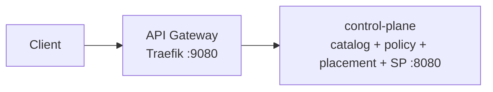

# DCM API Gateway

Central clearing house for the DCM control plane: single entry point (ingress) and single exit point (egress) for all communication.

## Overview

- **Ingress:** Clients and frontends send REST requests to the gateway; the gateway routes them to the **control-plane** monolith (`quay.io/dcm-project/control-plane`).
- **Egress:** Outbound calls from DCM to external systems are intended to go through the gateway (see [Egress](#egress) below). Placeholders only in this deliverable.
- **Stateless:** No server-side sessions; each request is independent.
- **Auth:** Not in scope for the first deliverable; Keycloak (or another IdP) will be added later.



## Running the gateway

### Prerequisites

- [Traefik](https://doc.traefik.io/traefik/) (see [installation guide](https://doc.traefik.io/traefik/getting-started/install-traefik/) or use the container image).

### Validate config

```bash
make validate-config
```

### Run locally (gateway and control-plane)

From the `api-gateway` directory, start the **default** Compose stack:

```bash
cd api-gateway
make run
```

`make run` is equivalent to `podman compose up -d` or `docker compose up -d` (whichever engine you use).
It starts **Traefik**, **PostgreSQL**, **NATS**, and **control-plane** (monolith on `:8080`).

It does **not** start the optional **service provider** containers (`kubevirt-service-provider`, `k8s-container-service-provider`, `acm-cluster-service-provider`). 
Those services are declared with [Compose profiles](https://docs.docker.com/compose/how-tos/profiles/) in `compose.yaml` (`kubevirt`, `k8s-container`, `acm-cluster`, or `providers`
for all of them), so they only run when you pass `--profile`. 
See [RUN.md — Running with service providers](RUN.md#running-with-service-providers) for required environment variables and provider-specific setup.

The gateway is at `http://localhost:9080`. Stop with `make compose-down`. To run only the gateway binary on the host (no Compose, e.g. when backends are elsewhere), use `make run-gateway-only`.

**Credentials:** Compose uses `POSTGRES_USER` and `POSTGRES_PASSWORD` (defaults: `admin` / `adminpass` for local dev). To override, set them in the environment or in a `.env` file (see `.env.example`).

### Image versions

The control-plane image defaults to `:main` but can be pinned via `CONTROL_PLANE_VERSION` in `.env`.
Requires [control-plane](https://github.com/dcm-project/control-plane) image on Quay (see control-plane PR for CI push).

#### Available tag formats

Service repos push images to `quay.io/dcm-project/<service>` with the following tags:

| Tag format | Example | When created |
|---|---|---|
| `main` | `main` | Every push to `main` |
| `<short-sha>` | `a6882f7` | Every push to `main` or `release/v*` branch, and `v*` git tag pushes |
| `v<semver>-rc.N` | `v0.0.1-rc.2` | Retag script (promotes a release branch SHA to an RC tag) |
| `v<semver>` | `v0.0.1` | When a `v*` git tag is pushed (final release) |

Browse available tags for a service at `https://quay.io/repository/dcm-project/<service>?tab=tags`.

#### How to pin a version

Set the corresponding variable in `.env` (see `.env.example` for the full list):

```bash
CONTROL_PLANE_VERSION=v0.0.1
```

Omitting the variable defaults to `main`.

| Variable | Service |
|---|---|
| `CONTROL_PLANE_VERSION` | control-plane monolith |
| `KUBEVIRT_SERVICE_PROVIDER_VERSION` | kubevirt-service-provider (`kubevirt` or `providers` profile) |
| `K8S_CONTAINER_SERVICE_PROVIDER_VERSION` | k8s-container-service-provider (`k8s-container` or `providers` profile) |
| `ACM_CLUSTER_SERVICE_PROVIDER_VERSION` | acm-cluster-service-provider (`acm-cluster` or `providers` profile) |

#### How to check deployed versions

Run `podman compose config` (or `docker compose config`) to see the resolved image references:

```bash
podman compose config | grep "quay.io/dcm-project"
```

#### How to update versions

1. Check available tags on [quay.io/dcm-project](https://quay.io/organization/dcm-project) for the service you want to update.
2. Set the version variable in `.env`:
   ```bash
   CONTROL_PLANE_VERSION=v0.0.1
   ```
3. Restart the stack to pull the new image:
   ```bash
   make run                    # core stack (gateway + control-plane)
   make run-with-providers     # or, if running with service providers
   ```

### Gateway configuration

The gateway uses [Traefik's file provider](https://doc.traefik.io/traefik/providers/file/) to load routing configuration from YAML files. This approach works identically in Docker Compose and Kubernetes (via ConfigMap), enabling a single configuration for both deployment targets.

| File | Purpose |
|---|---|
| `config/traefik.yml` | Static configuration — entrypoints, providers, logging |
| `config/dynamic/routes.yml` | Dynamic configuration — routers, services, and middleware |

**Adding or modifying an endpoint** only requires editing `config/dynamic/routes.yml`. Routes are grouped by backend service. Each backend is defined as a Traefik service with a load balancer URL, and routers match request paths to services.

After editing, validate with `make validate-config`.

### Kubernetes deployment

The same configuration files work in Kubernetes. Mount them as a ConfigMap:

```bash
kubectl create configmap traefik-config \
  --from-file=traefik.yml=config/traefik.yml \
  --from-file=routes.yml=config/dynamic/routes.yml
```

Then mount the ConfigMap into the Traefik pod at `/etc/traefik/traefik.yml` and `/etc/traefik/dynamic/routes.yml`.

### Testing locally

1. **Validate and start the core stack (gateway + control-plane)**
   ```bash
   make validate-config
   make run
   ```
   The gateway is at `http://localhost:9080`.

2. **Smoke test (gateway only)**
   With no backends running, use `make run-gateway-only` and check:
   ```bash
   curl -s http://localhost:9080/ping
   ```
3. **Health checks (gateway + control-plane)**
   After `make run`, legacy per-domain health paths still work and map to the monolith health endpoint. For example: `curl -s http://localhost:9080/api/v1alpha1/health/providers` or `curl -s http://localhost:9080/api/v1alpha1/health`. Stop with `make compose-down`.

## Route mapping

| Path prefix                              | Backend        |
|------------------------------------------|----------------|
| `/api/v1alpha1/health`                   | control-plane  |
| `/api/v1alpha1/health/providers`         | control-plane  |
| `/api/v1alpha1/health/catalog`           | control-plane  |
| `/api/v1alpha1/health/policies`          | control-plane  |
| `/api/v1alpha1/providers`                | control-plane  |
| `/api/v1alpha1/service-type-instances`   | control-plane  |
| `/api/v1alpha1/service-types`            | control-plane  |
| `/api/v1alpha1/catalog-items`            | control-plane  |
| `/api/v1alpha1/catalog-item-instances`   | control-plane  |
| `/api/v1alpha1/policies`                 | control-plane  |

Placement `/resources` and policy evaluation HTTP are **not** exposed; provisioning runs in-process inside control-plane.

Health paths above are GET-only; other paths support multiple methods. The `catalog-item-instances` prefix also covers `POST ...:rehydrate`. See `config/dynamic/routes.yml` for the full list. Traefik exposes `GET /ping` for the gateway process only.

## Egress

Egress (outbound traffic from DCM to external Service Providers) is **documented** and **placeholders** are present in the config; there is no full implementation in this deliverable.

**Intended model:** The gateway will act as the single **exit** point: when a manager (or the platform) needs to call an external Service Provider, the call will go **manager → gateway → external SP**. That gives one place for policy, logging, and TLS to external SPs.

**In this repo:** When the egress flow is implemented, add outbound routes to `config/dynamic/routes.yml`.

## Authentication (future)

Authentication and token validation (e.g. Keycloak, JWT) are **not** in the first deliverable. When added, the gateway will validate tokens and forward identity to backends using Traefik's [ForwardAuth middleware](https://doc.traefik.io/traefik/middlewares/http/forwardauth/).
